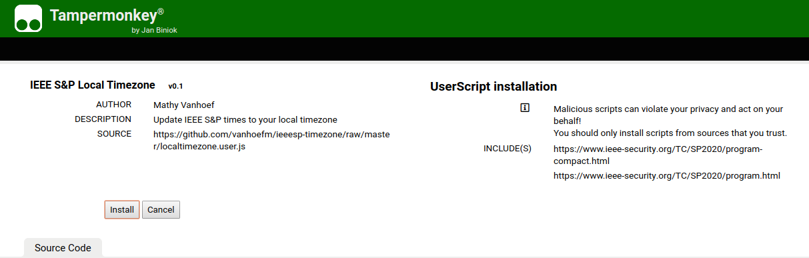

Convert the program times on the [website for the 2020 IEEE Symposium on Security and Privacy](https://www.ieee-security.org/TC/SP2020/program.html) to your local timezone!

## Installation instructions

The script requires the tampermonkey extension in Chrome or Firefox. Rough installation instructions below.

### Install the `Tampermonkey` extension

* https://addons.mozilla.org/en-US/firefox/addon/tampermonkey/
* https://chrome.google.com/webstore/detail/tampermonkey/dhdgffkkebhmkfjojejmpbldmpobfkfo?hl=en

### Install the conversion script

Head over to: 

https://github.com/vanhoefm/ieeesp-timezone/raw/master/localtimezone.user.js

Now click the "install" button and refresh the IEEE S&P program page to enjoy customized timezones.
